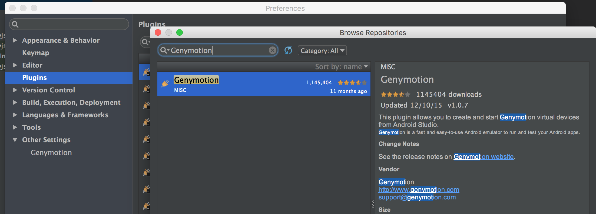
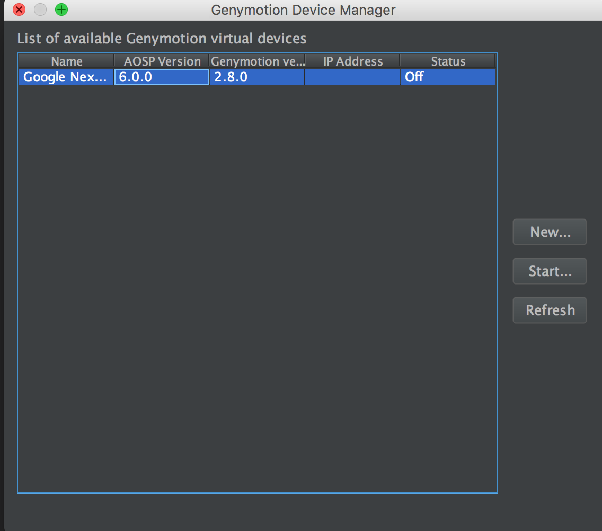
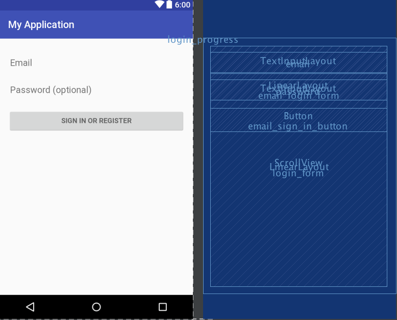
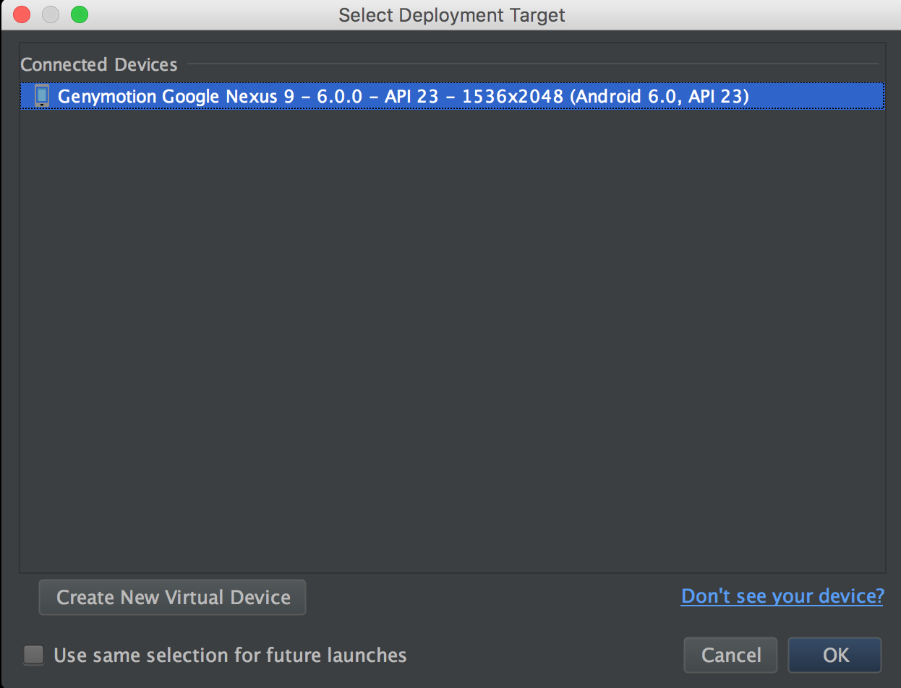
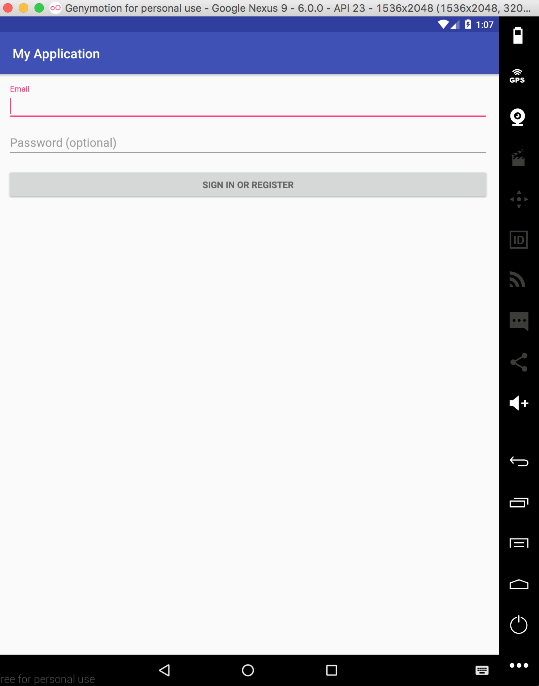

## 目的

- Mac电脑上面搭建Android模拟器
- 将APP运行在模拟器中

> 自己最近刚把电脑重新安装，顺便梳理下整修安装过程。为后面研究[Espresso](https://developer.android.com/training/testing/ui-testing/espresso-testing.html)做准备

<!--more-->

## 安装Android Studio

> `MAC`电脑进行Android开发的IDE。

- 下载最新的`Android Studio`, [Android-Studio-2.2.2.0](https://dl.google.com/dl/android/studio/install/2.2.2.0/android-studio-ide-145.3360264-mac.dmg)
- 安装完成即可

## 安装Genymotion

> Android模拟器，运行速度较快，个人`Free`。支持40多种安卓设备及`所有`的安卓版本。

- 安装`Virtual Box`，[下载页](https://www.virtualbox.org/wiki/Downloads)

- 下载Genymotion
  - 注册`个人`账号，登录
  - 下载Genymotion, [下载页](https://www.genymotion.com/download/)
  - 安装完成即可

- 下载模拟器
  - 进入本机安装的Genymotion
  - 登录`个人`账号，选择一个`模拟器`下载:Google Nexus 9 - 6.0.0
  
  - 一个`模拟器`大概200M左右，等待下载完成即可
  
  - 点击`Devices`列表中的`Google Nexus 9 - 6.0.0`，点击`Start`，会启动`Adnroid`模拟器
  

## 集成

- 安装Android Studio的Genymotion插件
  - `command+,` --> `plugins` --> `Browse Repositories`
  - 搜索`Genymotion`
  
  - 进行安装，结束后`重启`AndroidStudio
- 关联Genymotion到AndroidStudio
  - 点击`ToolBar`的最后一个`Genymotion Device Manager`
  - 在弹出框中，添加`Genymotion`程序
  
  - 关联成功后，再次打开`Genymotion Device Manager`，会显示之前添加的`Google Nexus 9 - 6.0.0`
  
  - 点击`Start`，可直接启动Genymotion的模拟器

> 至此，我们已经完成通过AndroidStudio来启动Android模拟器。下面再看下如何启动将自己的APP在模拟器中运行

## 运行自己的APP在Genymotion中

- 创建一个新的APP项目
  - 使用`Login Activity`模板创建一个APP项目
  - 名称为`MyApplication`
  
- 在模拟器中运行
  - 点击`Run`时，会弹出选择运行的环境。如果列表为`空`，请查看是否模拟器`未启动成功`
  
  - 选择`Google Nexus 9 - 6.0.0` --> `OK`，在模拟器中运行`MyApplication`程序
  

## 总结

- 通过AndroidStudio来跑模拟器，本质上是在执行Genymotion
- AndroidStudio自身也有模拟器，在`ToolBar` --> `AVD Manager`中可添加，但可选范围过小
- 有了不同类型的模拟器后，便可针对不同的机型进行`兼容性`测试
